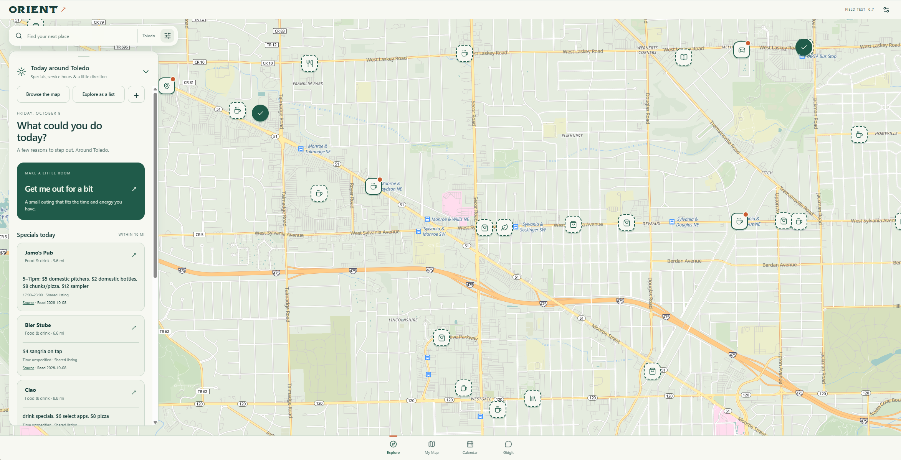

# Orient

**Get to know your city. Help someone else feel at home in theirs.**



Orient began in Toledo, Ohio, with a personal question: *How can a map nudge me to leave the house and explore?*

A comic shop I keep meaning to visit. Coffee before the thrift store. A quiet bench by the river. Somewhere I can walk into alone and feel comfortable. The useful parts of a city often come from trying a place, talking to someone, and remembering one small thing.

Orient gives those things a home: a private map that becomes more familiar as you use it. Now it also has a way to share the knowledge you choose to contribute, through a place commons carried by GitHub.

**There is a reason to join now. Try it where you live. Bring a little local knowledge. Help us build what comes next.**

## Your map stays yours

Start in your own city. Save places, add notes and photos, remember visits, make a small circuit for Sunday, or find a reason to get out today. Fog gives way as you mark your map. Open now lights up places with recognized opening hours.

- **Explore with a little direction.** A compact daily briefing surfaces specials, nearby service hours, and places you’ve saved but haven’t tried. Expand it when you want a nudge; keep the map in view when you don’t.
- **Take your map somewhere else.** Tap the city beside search to explore Detroit, Ann Arbor, Cleveland, or your own destination. Recent areas remember their map positions. Home stays home.
- **Remember what matters to you.** Personal categories, ratings, notes, photos, recurring events, and circuits make the map useful on your terms. Add a photo and a note without filling out a business profile.
- **Use the information a place publishes.** Address lookup and a reviewed website reader help fill in hours, contact details, social links, and readable calendar data.
- **Ask for help if you want it.** Gidgit is an optional local AI companion for questions about your saved map and reviewed detail updates. It stays hidden when disabled and uses local Ollama, with no cloud fallback.

No account is needed. Your map is stored in your browser, with private sync to the computer running Orient for paired devices. Public contributions use a separate, explicit flow.

## The place commons

A map can tell you where something is. A small observation can make it easier to go:

> “You can browse without buying.”
>
> “There’s seating where you can stay a while.”
>
> “This stretch of the river is quiet.”

In Orient, choose **Share this note** on a place, trim the part you want to contribute, and tick the consent box. Orient shows what will be shared in plain words, then opens GitHub’s own new-file page with the contribution filled in; you sign in as yourself and press **Propose new file** and **Create pull request**. No token and no account linking are needed. The original note stays private and unchanged. Each shared claim carries a type, observation date, source identity, and optional credit, and places are anchored by latitude and longitude, with no OSM identity requirement.

Anyone can host a commons: [`commons-template/`](commons-template/README.md) is a repository you copy, with a check on every contribution and a snapshot that rebuilds when you merge.

Someone else can load that bundle, review individual claims, and decide what belongs on their map. Nearby coordinates suggest matches; the person importing chooses whether to link an existing place or create a new one. Shared observations sit in a compact fold with attribution, separate from private notes.

**The neighbor guide never participates.** People fields, visit histories, saved lists, photos, circuits, and calendar data are excluded from public bundles. The contributor reviews the chosen text for personal information before sharing it.

### Multiple commons, even in the same city

You can maintain a Toledo commons. Someone else can maintain another Toledo commons. A third person can combine contributions from both while preserving their original source identities. A source ID records provenance; it grants no ownership of a city.

GitHub carries reviewed JSON snapshots, pull requests, forks, and history. Orient provides the interface for reviewing and combining them. The first working loop supports file import/export and public GitHub snapshot loading. Publishing is explicitly triggered in Orient, which creates the branch, contribution file, and pull request. Nothing pulls or uploads in the background.

**Try the loop:** [commons guide](commons/README.md) · [fictional example bundle](commons/examples/toledo.snapshot.json) · [public schemas](commons/schema/)

## Run it in your city

You need Node.js 18 or later. There are no app dependencies to install and no build step.

```sh
git clone https://github.com/ragingapathy/orient.git
cd orient
node server.cjs
```

Open [localhost:4173](http://127.0.0.1:4173), choose your home city, and add a place you know or want to try. A fresh map does not load the author’s private Toledo catalog.

For commons import, open **Field kit → Place commons**. To contribute, expand a place’s **People & notes → Share this note**. Enter the destination commons repository once (a pasted GitHub link works) and press **Open on GitHub to finish**. **Copy the file** and **Download the file** are alternatives, and publishing straight from Orient with a GitHub token remains under **Other ways to share**.

Docker, phone pairing, backups, Google Maps imports, local AI setup, and the fuller feature reference are in the [user guide](docs/user-guide.md). Development history is in the [changelog](CHANGELOG.md).

## Come build with us

This is a working prototype with room for other people’s ideas and judgment. You don’t need to be in Toledo, and you don’t need to write code to help shape it.

- **Try a real outing.** Tell us where Orient helped you leave the house, where it got in the way, and what you needed that it didn’t know.
- **Start a local commons.** Contribute a few useful observations, review someone else’s, or maintain a snapshot for your city. A small, cared-for collection is a good beginning.
- **Make the interface better.** Help with mobile interactions, accessibility, clearer language, and making useful information fit a small screen.
- **Build the next piece.** Better commons review and merging, easier GitHub contributions, more reliable hours parsing, and thoughtful ways to turn saved places into actual outings are all welcome directions.
- **Bring a different perspective.** What makes a place approachable depends on the person. Help us ask better questions and represent observations with enough context to be useful.

[Open an issue](https://github.com/ragingapathy/orient/issues) with an idea, a bug, or something you learned using it. For a change, fork the repo and open a pull request explaining what it helps someone do. For a larger change, start with an issue so we can work through the shape together. Use fictional places and notes in examples; keep personal exports and local catalogs out of commits.

The app is plain JavaScript and CSS in `public/`, with a small Node server in `server.cjs`. No framework or compilation pipeline stands between you and an experiment. The commons protocol and UI live in `public/commons-data.js` and `public/commons.js`; the format and contribution workflow are documented in [commons/README.md](commons/README.md).

Run `npm run check` for syntax checks and `node commons-check.cjs` for the public-data protocol checks. Browser checks use Playwright and Chrome; see the [user guide](docs/user-guide.md#checks) for setup and limitations.

## Where things stand

The private map and reviewed commons loop work today. The project is early, interfaces are evolving, and setup is still aimed at people comfortable running a small server. Source identities are attribution, not verified authorship. Observations can age; dates, sources, and contested or retired status help keep that visible.

GitHub publishing is available after one-time connection in Orient. This self-hosted version connects with an access token stored encrypted on the Orient computer; a GitHub sign-in flow without token setup remains future work. There is no hosted multi-user service or background contribution pipeline.

## License and credits

Orient’s application code is licensed under [PolyForm Noncommercial 1.0.0](LICENSE). Contributions to the place commons use **CC BY 4.0**, as declared in each public bundle. These are separate licenses; contributing an observation does not make your private map public.

Map data © [OpenStreetMap](https://www.openstreetmap.org/copyright) contributors; basemap by [OpenFreeMap](https://openfreemap.org/). Vendored libraries and fonts retain their own licenses. See the [user guide](docs/user-guide.md#credits-and-license) and `public/vendor/` for credits.

**Start with one place. Make it easier for someone to go. Build from there.**
